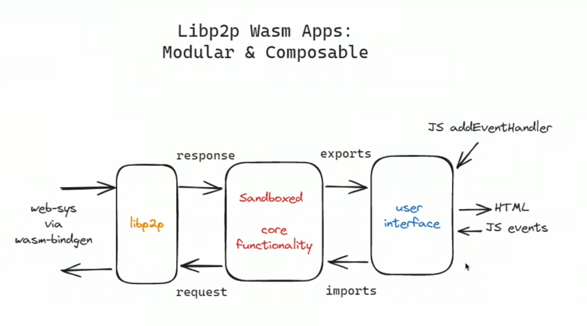

# Enhancing Privacy and Security in Offline App Design with WebAssembly

Introduction:

In the realm of application development, a shift towards designing offline apps by default is imperative for enhanced privacy and security. One key consideration involves the separation of folders for online connections and those accessed by the application for computation, ensuring data privacy without compromising functionality.

Specification:

**Isolating Online Connection and App-Read Folders:**

- How can we segregate folders for online connections and those read by the app for computation to prevent data transmission to the server?

**Ensuring Data Privacy:**

- How can we determine which software reads data without transmitting it to the server?

**Interaction with Server in the Absence of Data Read:**

- If the software is restricted from reading data, how will it interact with the server?

## Two App Paradigm: `Online App` and `Offline App` with [intents](../rust/one_wallet_app.md) based communication.

The `Online App` has access only to an `Online Folder`, whereas the `Offline App` has access to both an `Offline Folder` and an `Online Folder`.

"In this framework, we introduce two distinct applications: the `Online App`, a publicly audited high-security app with internet access, serving as the gatekeeper for all `Offline Apps` compatible with it, and the `Offline App`, designed for user interaction without direct internet access. The `Offline App` operates in a sandboxed environment, utilizing technologies like [firejail](./firejail.md) for added security.

**Communication Framework:**

- The `Online App` provides an API endpoint with three fields for the `Offline App`: a data description, the data itself, and the function name of the WebAssembly (wasm) code. Custom wasm code is one time uploaded to `Online App` by `Offline App`. Custom wasm logic facilitates remote server communication, enhancing interoperability.

**User Traceability:**

- Data exchanged between the `Offline App` and `Online App` can be traced by users, offering transparency and the ability to maintain logs.

**Differentiation from Browsers:**

- Unlike browsers, where file reads are potentially transmitted to servers due to constant internet connectivity, the `Offline App` allow intermittent internet access, promoting the development of offline-centric applications.

**Promoting Offline App Development:**

- By eliminating the necessity for constant internet connection, developers are encouraged to create offline apps, enhancing user privacy. For instance, a code editor like VSCode only requires internet access for initial downloads. But currently, apps are free to connect to the internet all the time, you never know what is going on in the background. You can't use [Firejail](./firejail.md) because it completely disables the internet for the app. Open source helps, but as software has become highly complicated, security analysis of open source software is left to only a few developers.

**Permission-Based Connection:**

- Implementing permission-based connections and providing a user interface for monitoring data flow ensures better control and transparency.

**Enhancing User Experience:**

- To mitigate the need of constant monitoring, introduce regex-based file ignore functionality, similar to .gitignore, allowing users to specify files that are exempt from server access in the `Online Folder`.

**Addressing Security Concerns:**

- What if the data that goes to the `Online App` is encrypted or obscured, so that you can't trace what data is being sent? Encrypting or obscuring data sent to the `Online App` can be mitigated by only transmitting unobscured data or files. The `Online App` can verify the integrity of received data by comparing it to the original files in its designated folder.


Conclusion:

A privacy-centric approach to app development, emphasizing offline functionality and transparent communication, not only enhances security but also empowers users to have greater control over their data. By implementing features such as permission-based connections, user traceability, and file ignore options, we can strike a balance between functionality and safeguarding user privacy.

A similar experiment to design crypto wallet using intents here: [One Wallet App](../rust/one_wallet_app.md)

### Sandboxed core functionality



<p style="text-align:center;">
  <cite><a href="./libp2p.md">Full Stack rust-libp2p apps</a></cite>
</p>


### Challenges

Designing two separate apps can be a bit complicated. It would be easier for both app developers and users if all three modules (as shown in the image) were integrated into a single app. However, consolidating them into a single app might make it challenging for users to trust the app even if it's open source and lacks sufficient code reviewers.

Here is another model: all WebAssembly modules are assembled in a single package, whereas a generic module is used for sandboxing the files and folders. Any app developer can utilize this module, and it can be easily validated by users or developers without requiring much skill.


## Security enhancement of an operating system (e.g. Linux OS)

With technology like [AppImage](./appimage.md), there is no need to change the operating system. This further increases the security of the OS. One can also check if something has changed or tampered in the system files crucial for security by obtaining the hash of the OS folder, as it will have the same hash at all times. In the case of an OS update, the changed hash can be publicly declared.

If you just want to check if something in the folder changed:

```bash
ls -alR --full-time /folder/of/stuff | sha1sum
```

But how can we trust the compromised linux operating system software that generates the checksum? We don't have to. For example, Ubuntu software provides a checksum for publicly audited software. One can install the Ubuntu on a pendrive and verify the checksum of the folder containing the Linux OS installed on the computer's hard disk.


## Wasm interface types

[Wit Bindgen](https://github.com/bytecodealliance/wit-bindgen) uses Guest language bindings generator for WIT and the Component Model. With it different modules (or apps) can talk with each other. Its also used for the [Tauri Inter-process communication (IPC) bridge](https://github.com/tauri-apps/tauri-bindgen)

## Anonymity Protocols in rust

One can use anonymous protocols like Tor by default with tauri apps or AppImage to protect users.

> Defend yourself against tracking and surveillance. Circumvent censorship.

[Arti](https://tpo.pages.torproject.net/core/arti/) is a project to implement the Tor anonymity protocols in the Rust programming language.
